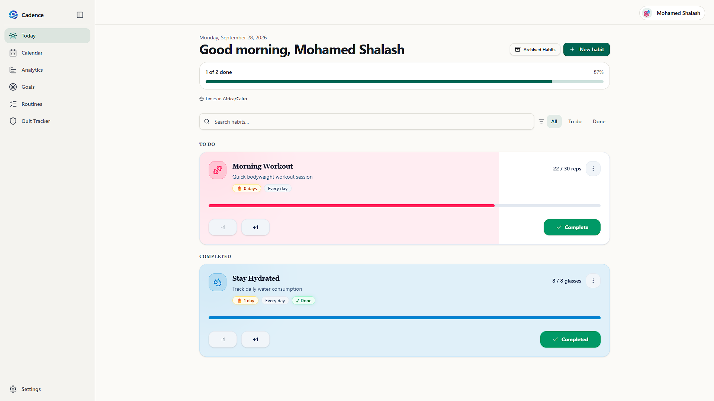
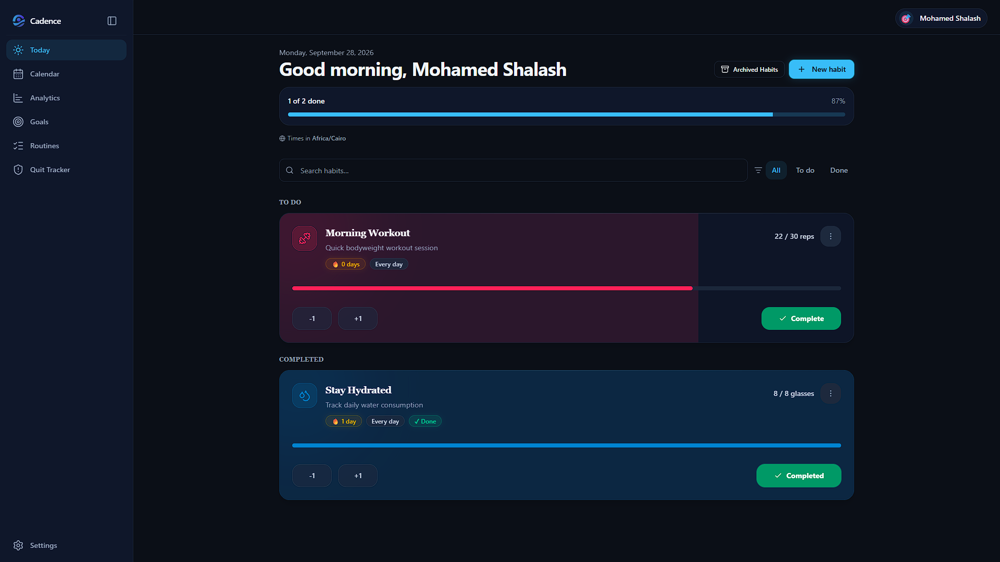
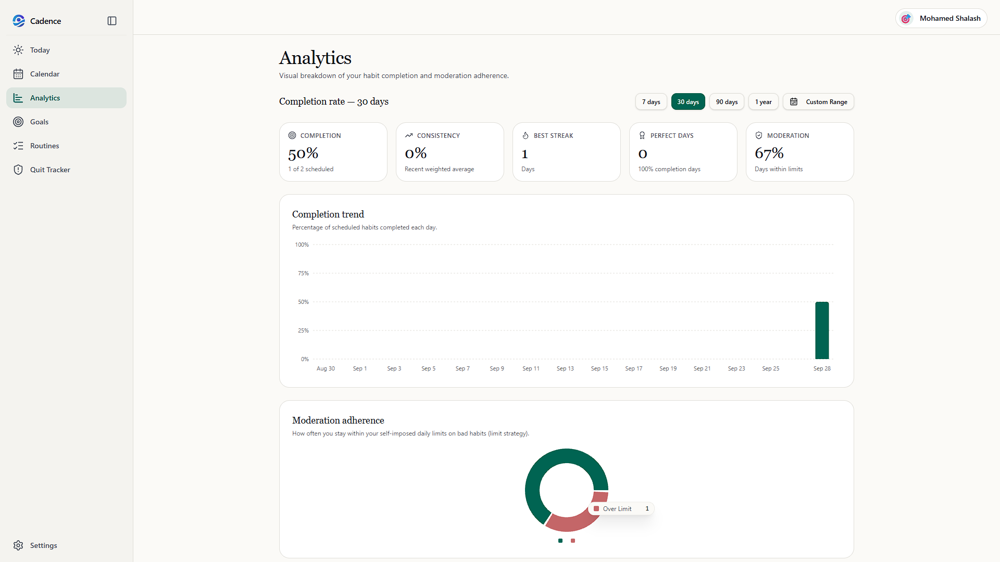
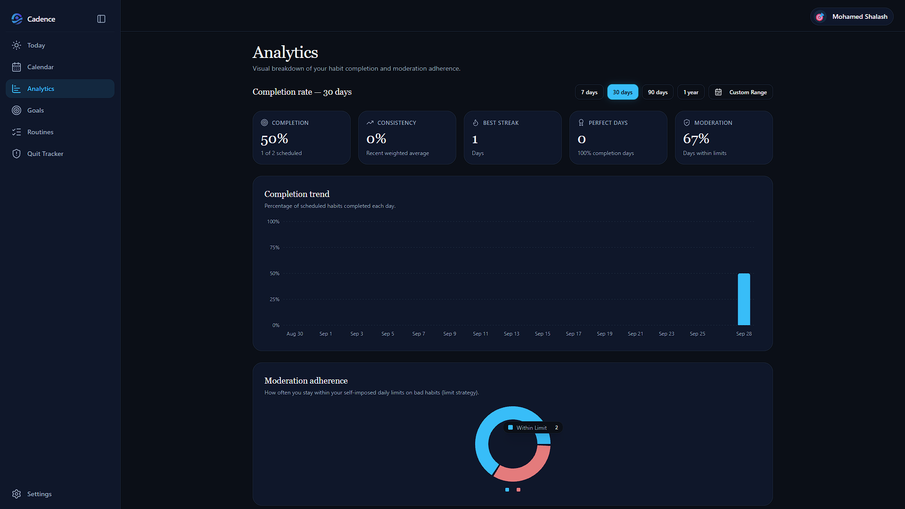
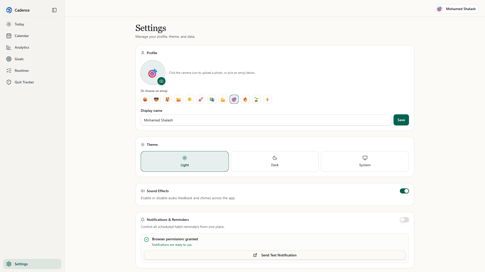
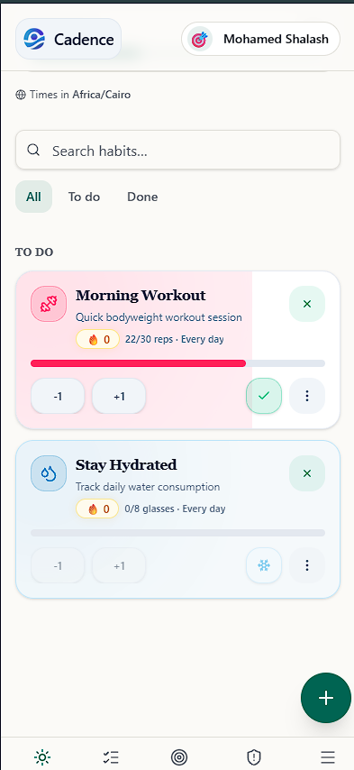

<div align="center">
  

  <h1>Cadence - Offline-First Habit Tracker</h1>

  <p>
    <strong>A lightning-fast, beautiful, and completely offline habit tracker designed to help you build consistency and maintain your momentum.</strong>
  </p>

  <p>
    
    
    
    
    
  </p>
</div>

## 📸 Screenshots

| Light Mode | Dark Mode |
| :---: | :---: |
|  |  |
| **Light Statistics** | **Dark Statistics** |
|  |  |
| **Settings** | **Mobile Experience** |
|  |  |

## ✨ Key Features

*   **⚡ 100% Offline Architecture:** Cadence works completely offline. Your data is stored locally using IndexedDB, ensuring zero latency and absolute privacy. No internet? No problem.
*   **📱 Progressive Web App (PWA):** Install Cadence directly to your home screen or desktop. It functions perfectly as a native-feeling app on any device, complete with offline support and standalone launch.
*   **↩️ Robust Undo System:** Made a mistake? Our comprehensive undo system ensures you can effortlessly revert changes without fear of losing your progress or messing up your streak.
*   **🌗 Beautiful UI:** A clean, modern interface with support for both light and dark modes, built for focus and ease of use.

## 🛠️ Tech Stack

*   **Frontend Framework:** React
*   **Styling:** Tailwind CSS
*   **Data Persistence:** IndexedDB
*   **Platform:** PWA
*   **Deployment:** Vercel

## 🚀 Local Setup

To get a local copy up and running, follow these simple steps.

**1. Clone the repo**
```sh
git clone https://github.com/your_username/cadence.git
cd cadence
```

**2. Install NPM packages**
```sh
npm install
```

**3. Run the development server**
```sh
npm run dev
```
